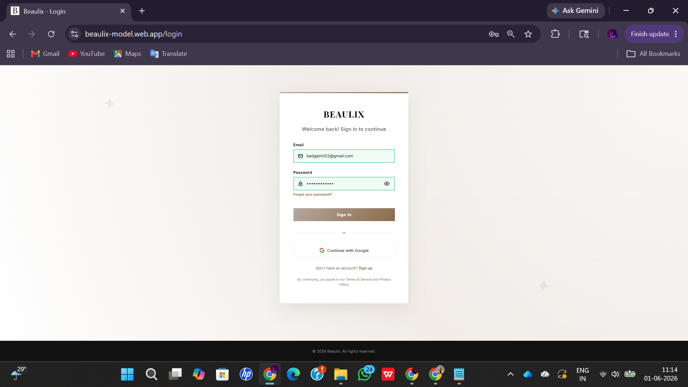
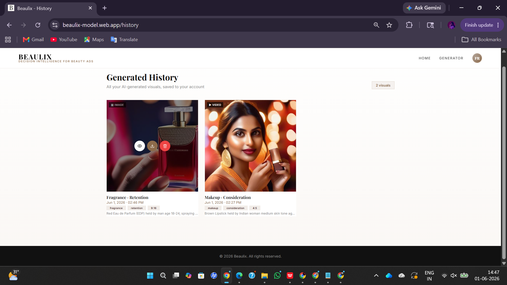
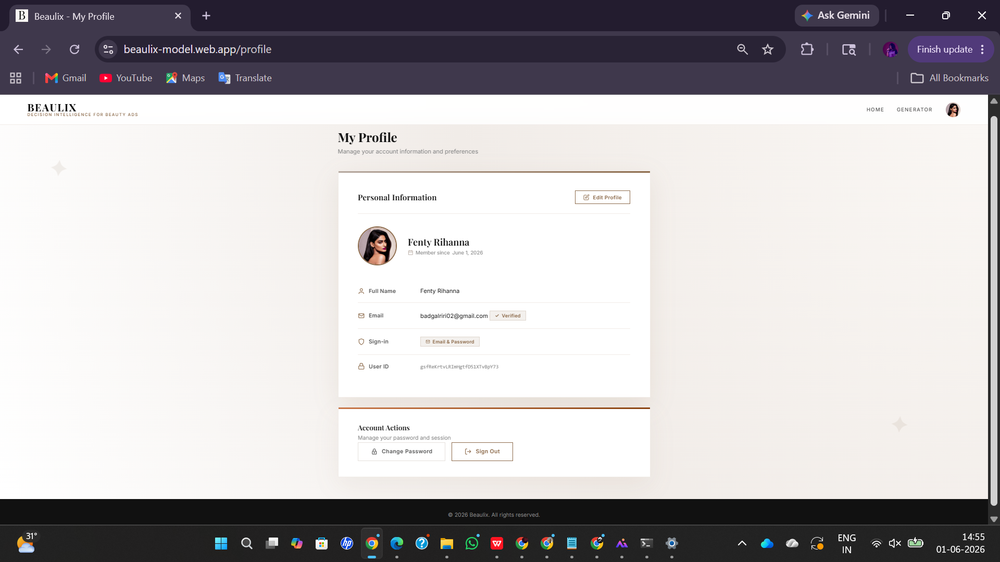

# BEAULIX — AI-Based Decision Intelligence for Beauty Ads

> A web-based platform that combines machine learning prediction and generative AI to help users create, evaluate, and optimize beauty advertisements.

Developed as a 6th Semester BCA project at **Mount Carmel College, Autonomous, Bengaluru** (2025–2026).  
**Author:** Dhriti Jagan Mohan

---

## Table of Contents

- [Overview](#overview)
- [Screenshots](#screenshots)
- [Features](#features)
- [Tech Stack](#tech-stack)
- [System Architecture](#system-architecture)
- [Project Structure](#project-structure)
- [Getting Started](#getting-started)
  - [Prerequisites](#prerequisites)
  - [Environment Variables](#environment-variables)
  - [Frontend Setup](#frontend-setup)
  - [Backend Setup (ML Prediction Server)](#backend-setup-ml-prediction-server)
  - [Generative AI Setup (Google Colab + GPU)](#generative-ai-setup-google-colab--gpu)
- [API Reference](#api-reference)
- [Usage Walkthrough](#usage-walkthrough)
- [Performance Benchmarks](#performance-benchmarks)
- [Limitations](#limitations)
- [Future Enhancements](#future-enhancements)

---

## Overview

The beauty and cosmetics industry depends heavily on visually compelling, audience-targeted advertisements. **Beaulix** addresses the challenge of creating such ads by providing a structured, AI-powered platform where users can:

1. Define a **marketing strategy profile** (product category, audience, occasion, funnel stage).
2. Get **ML-predicted performance metrics** (CTR, conversion rate, engagement rate, confidence score).
3. Define **visual parameters** (product type, color, brand style, scene description, skin tone, aspect ratio).
4. Generate **AI-created advertisement visuals** (images or short videos) using Stable Diffusion XL (SDXL).
5. Receive **ad copy suggestions** (headline, description, CTA) and **platform recommendations**.
6. Save and revisit all generated content through a **history page**.

The overall pipeline is:

```
User Input → Data Processing → ML Prediction → AI Visual Generation → Output Display → Firebase Storage
```

---

## Screenshots

### Home Page
The landing page introduces Beaulix with the tagline *"Turn product type + concern into ads that convert"*, flanked by example beauty ad visuals. Navigation links to Home, How It Works, Features, Examples, and Log In.


---

### Sign Up & Login
Clean, card-based authentication forms with email/password fields and a **Continue with Google** option on the login page. Sign-up collects Full Name, Email, Password, and Confirm Password.

| Sign Up | Login |
|---|---|
|  |  |

---

### Generator — Step 1: Marketing Strategy Profile
Users define their campaign inputs: **Product Category**, **Occasion**, **Skin Type**, **Makeup Focus**, **Funnel Stage** (Awareness / Consideration / Conversion / Retention), **Age Range**, and **Gender**. The active profile summary is shown as tags before hitting **Analyse Marketing Profile**.


---

### Generator — Step 1 Results: Marketing Analysis Output
After analysis, a dark results panel displays four predicted performance metrics with confidence intervals:

| Metric | Example Result |
|---|---|
| Predicted CTR | 3.36% — 19% above avg |
| Predicted Conversion | 1.41% — 3% above avg |
| Engagement Rate | 4.31% — 16% above avg |
| Confidence Score | 92.6% — Exceptional |

A **Recommended Visual Strategy** block suggests scene description, brand style, whether to include a human face, aspect ratio, and output type — and pre-fills Step 2 automatically.


---

### Generator — Step 2: Visual Generation (Input)
Step 2 collects: **Product Type**, **Product Colour**, **Scene Description** (free text), **Brand Style**, **Include Human Face** toggle, **Gender**, **Age Range**, **Skin Tone** (Fair / Light / Medium / Tan / Deep), **Region / Ethnicity**, **Aspect Ratio** (1:1 Square, 9:16 Portrait, 16:9 Landscape, 4:5 Instagram), **Output Type** (Image / Video), and **Duration** for videos. A progress bar appears during generation.

| Visual Parameters | Aspect Ratio & Output |
|---|---|
|  |  |

---

### Generator — Step 2 Results: Generated Visual & Ad Copy
The Preview panel renders the SDXL-generated image or video inline. Below it, the **Ad Text** section shows five individually-copyable fields — Hook / Opening Line, Headline, Primary Text, CTA, and Offer / Promotion. A **Recommended Targeting** chip list, **Best Platform Placement** tags (e.g. Instagram, YouTube, Pinterest), and a creative performance uplift card showing Conv, CTR, and Engagement gains vs baseline complete the output.

| Generated Visual + Ad Copy | Targeting & Performance Uplift |
|---|---|
|  |  |


---

### Generated History
A gallery of all previously created ads. Each card shows a thumbnail with an IMAGE or VIDEO badge, campaign name, date/time, category and funnel tags, aspect ratio, and a truncated prompt. Hovering reveals **View**, **Download**, and **Delete** action buttons.



---

### My Profile
Shows account details — Full Name, Email (with Verified badge), Sign-in method, and User ID — plus an Account Actions section with **Change Password** and **Sign Out**. Avatar is uploaded via Cloudinary.



---

## Features

| Feature | Description |
|---|---|
| Marketing strategy profile | Structured input: product category, funnel stage, age range, gender, occasion |
| ML performance prediction | Predicts CTR, conversion rate, engagement rate + confidence score |
| Visual strategy recommendations | Budget tiers, platform placement, seasonal hooks, audience hooks |
| Generative ad visuals | AI-generated images and short videos via SDXL on Google Colab GPU |
| Ad copy generation | Hook line, headline, product description, CTA, offer/promotion |
| Multiple output formats | 1:1 (Square), 9:16 (Portrait), 16:9 (Landscape), 4:5 (Instagram) |
| History page | Browse, preview, download all previously generated ads |
| Firebase authentication | Email/password sign-up and login, Google sign-in, password reset |
| Cloudinary integration | Cloud storage and delivery for generated media |
| Unlimited generation | No cap on the number of ads a user can create |

---

## Tech Stack

| Layer | Technology |
|---|---|
| **Frontend** | HTML5, CSS3, JavaScript (modular JS files) |
| **Backend** | Python 3.9+, FastAPI, Uvicorn |
| **ML Model** | scikit-learn — Random Forest Regressor |
| **Generative AI** | Stable Diffusion XL (SDXL) via `diffusers`, PyTorch |
| **GPU Runtime** | Google Colab (CUDA) |
| **Database** | Firebase Firestore |
| **Auth** | Firebase Authentication |
| **Media Storage** | Cloudinary |
| **API Tunnel** | Ngrok (exposes Colab backend to the frontend) |
| **Hosting** | Firebase Hosting (`beaulix-model` project) |
| **Dev Environment** | VS Code |

---

## System Architecture

```
┌─────────────────────────────────────────┐
│           USER (Browser)                │
└────────────────┬────────────────────────┘
                 │
┌────────────────▼────────────────────────┐
│     FRONTEND (HTML / CSS / JS)          │
│  Input Forms → Prediction Display       │
│  → Visual Preview → History             │
└────┬──────────────────────┬─────────────┘
     │ User Input           │ Results
┌────▼──────────┐    ┌──────▼────────────┐
│  BACKEND      │    │  ML MODULE        │
│  (Python /    │───►│  Random Forest    │
│   FastAPI)    │    │  Regressor        │
│               │    └──────┬────────────┘
│  API (Ngrok)  │           │ Predicted Metrics
│               │    ┌──────▼────────────┐
│               │───►│  GENERATIVE AI    │
│               │    │  SDXL + Colab GPU │
└───────┬───────┘    └──────┬────────────┘
        │                   │
┌───────▼───────────────────▼────────────┐
│         DATABASE (Firebase)            │
│    Firestore · Auth · Hosting          │
│    Cloudinary (media storage)          │
└────────────────────────────────────────┘
```

---

## Project Structure

```
Beaulix/
│
├── frontend/                            # Firebase Hosting public directory
│   │
│   ├── index.html                       # Landing / home page
│   ├── index-module.js                  # Home page logic & animations
│   ├── index-init.js                    # Home page Firebase initialisation
│   │
│   ├── login.html                       # Login page
│   ├── login-module.js                  # Firebase email + Google sign-in
│   ├── signup.html                      # Sign-up page
│   ├── signup-module.js                 # Account creation logic
│   │
│   ├── generator.html                   # Main ad generator (Step 1 + Step 2)
│   ├── generator-module.js              # Step 1 — Marketing strategy & ML prediction
│   ├── generator-init.js                # Generator page initialisation & auth guard
│   ├── step2-module.js                  # Step 2 — Visual generation (SDXL)
│   │
│   ├── history.html                     # Generated history gallery
│   ├── history-module.js                # Firestore fetch, preview, download logic
│   │
│   ├── profile.html                     # User profile page
│   ├── profile-module.js                # Avatar upload, password change, account info
│   │
│   ├── password-reset.html              # Request password reset email
│   ├── password-reset-module.js
│   ├── reset-action.html                # Handle Firebase reset link (oobCode)
│   ├── reset-action-module.js
│   ├── reset-bridge.html                # Redirect bridge for auth action URLs
│   ├── reset-bridge-scripts.js
│   │
│   ├── nav-module.js                    # Shared navbar: auth state, avatar, dropdown
│   ├── firebase-config.js               # Firebase SDK initialisation & app export
│   ├── cloudinary-module.js             # Cloudinary unsigned upload helper
│   ├── suppress-firebase-warn.js        # Suppresses noisy Firebase console warnings
│   │
│   ├── theme.css                        # Design tokens (colours, fonts, shadows)
│   ├── layout.css                       # Shared navbar & footer styles
│   ├── generator.css                    # Generator page styles
│   ├── auth.css                         # Auth pages (login, signup, reset) styles
│   ├── responsive.css                   # Responsive / mobile breakpoints
│   │
│   ├── 404.html                         # Custom Firebase 404 page
│   ├── favicon.ico
│   │
│   └── assets/                          # Static images & demo media
│       ├── skincare.jpg
│       ├── makeup.jpg
│       ├── haircare.jpg
│       ├── perfume.jpg
│       ├── s1.jpg
│       ├── h1.png / h1.webp
│       ├── m1.mp4
│       └── p1.mp4
│
├── backend/                             # Python FastAPI ML prediction server
│   ├── server.py                        # FastAPI app entry point (port 8000)
│   ├── model.py                         # ML inference orchestrator (Random Forest)
│   ├── dataset.py                       # Training dataset builder
│   ├── train_simple_model.py            # Train / serialise the Random Forest model
│   ├── retrain.py                       # Retrain model on updated data
│   ├── confidence.py                    # Confidence score calculation
│   ├── targeting.py                     # Audience targeting recommendation engine
│   ├── copy_engine.py                   # Ad copy generation (hook, headline, CTA)
│   ├── copy_constants.py                # Copy templates & constants
│   ├── step2_engine.py                  # Step 2 creative-multiplier engine
│   ├── step2_constants.py               # Step 2 constants & lookup tables
│   ├── constants.py                     # Shared backend constants
│   ├── visual_lookup.py                 # Visual strategy lookup logic
│   ├── build_visual_cache.py            # Pre-build visual recommendation cache
│   ├── cache_manager.py                 # In-memory cache management
│   ├── excel_cache.py                   # Excel-backed prediction cache
│   ├── download_data.py                 # Download / refresh training data
│   ├── locks.py                         # Async file-lock utilities
│   ├── start.sh                         # Shell script to start the backend server
│   ├── .python-version                  # Python version pin (pyenv)
│   ├── requirements.txt                 # Production dependencies
│   ├── requirements-dev.txt             # Dev / test dependencies
│   ├── requirements-build.txt           # Build-time dependencies
│   │
│   ├── beaulix_combinatorial_predictions.xlsx   # ML training dataset
│   ├── beaulix_step2_recommendations.xlsx       # Step 2 recommendation data
│   ├── beaulix_visual_brief.xlsx                # Visual brief lookup data
│   │
│   └── tests/
│       ├── __init__.py
│       ├── test_copy_engine.py
│       ├── test_endpoints.py
│       └── test_targeting.py
│
├── colab/                               # Google Colab GPU components
│   ├── sdxl_model.py                    # FastAPI SDXL image/video server (port 8001)
│   └── tune/                            # Background music for generated videos
│       ├── bg_music_01.mp3
│       ├── bg_music_02.mp3
│       ├── bg_music_03.mp3
│       ├── bg_music_04.mp3
│       ├── bg_music_05.mp3
│       ├── bg_music_06.mp3
│       ├── bg_music_07.mp3
│       ├── bg_music_08.mp3
│       ├── bg_music_09.mp3
│       └── bg_music_10.mp3
│
├── functions/                           # Firebase Cloud Functions (Node.js)
│   ├── index.js                         # Cloudinary delete + Firebase Functions handlers
│   ├── package.json
│   └── package-lock.json
│
├── .env.example                         # Environment variable template (copy to .env)
├── .firebaserc                          # Firebase project alias (beaulix-model)
├── firebase.json                        # Firebase Hosting, Functions & Firestore config
├── firestore.rules                      # Firestore security rules
└── README.md
```

---

## Getting Started

### Prerequisites

| Requirement | Version |
|---|---|
| Python | 3.9+ |
| Node.js / npm | For Firebase CLI |
| Firebase CLI | `npm install -g firebase-tools` |
| Google Colab account | Free tier works; GPU runtime required for SDXL |
| Ngrok account | Free tier; for tunnelling Colab backend |
| Firebase project | Create at console.firebase.google.com |
| Cloudinary account | Free tier sufficient |

---

### Environment Variables

Copy `.env.example` to `.env` and fill in all values:

```env
# API security key — required in production
BEAULIX_API_KEY=<secret-random-string>

# Must match your Firebase Hosting URL exactly
BEAULIX_FRONTEND_URL=https://your-project.web.app

# Set to "production" to enforce the above two variables
BEAULIX_ENV=production

# Cloudinary credentials (from your Cloudinary dashboard)
CLOUDINARY_CLOUD_NAME=<your-cloud-name>
CLOUDINARY_API_KEY=<your-api-key>
CLOUDINARY_API_SECRET=<your-api-secret>

# Directory on Colab for music/audio assets (default: /content)
BEAULIX_MUSIC_DIR=/content
```

> **Never commit `.env` to version control.** The `.env.example` file is safe to commit.

---

### Frontend Setup

```bash
# 1. Install Firebase CLI (if not already)
npm install -g firebase-tools

# 2. Log in to Firebase
firebase login

# 3. Select your project
firebase use beaulix-model   # or your own project ID

# 4. Edit frontend/firebase-config.js with your Firebase project credentials

# 5. Deploy to Firebase Hosting
firebase deploy --only hosting
```

For local development, serve with any static server:

```bash
cd frontend
npx serve .          # or: python -m http.server 5500
```

---

### Backend Setup (ML Prediction Server)

The ML backend runs locally or on any server with Python 3.9+.

```bash
# 1. Install dependencies
pip install fastapi uvicorn scikit-learn numpy python-dotenv

# 2. Start the prediction server
python backend/main.py
# Runs on http://localhost:8000
```

If deploying to a remote server, update `BEAULIX_FRONTEND_URL` in `.env` and use a proper ASGI host instead of Uvicorn's dev mode.

---

### Generative AI Setup (Google Colab + GPU)

The SDXL image/video generation server must run on a GPU-enabled Colab notebook because of the high VRAM requirements of Stable Diffusion XL.

```python
# In a Colab cell (GPU runtime required):

# 1. Install dependencies
!pip install fastapi uvicorn diffusers transformers accelerate torch imageio pyngrok python-multipart

# 2. Upload sdxl_model.py to Colab, then run:
!python sdxl_model.py &   # Starts server on port 8001

# 3. Expose via Ngrok
from pyngrok import ngrok
tunnel = ngrok.connect(8001)
print(tunnel.public_url)   # Copy this URL into your frontend's generator JS
```

Update the `G` constant in `generator.html` / `generator-module.js` with the Ngrok URL:

```javascript
const G = "https://<your-ngrok-id>.ngrok-free.app";
```

> **Colab session note:** Free Colab sessions disconnect after ~90 minutes of inactivity. You will need to restart the server and update the Ngrok URL each session.

---

## API Reference

### ML Prediction Server — `POST /predict`

**Base URL:** `http://localhost:8000` (or your deployed backend URL)

**Request body (JSON):**
```json
{
  "category": "Makeup",
  "funnel":   "conversion",
  "age":      "25-34",
  "gender":   "Female",
  "style":    "Luxury Elegant",
  "occasion": "Wedding / Special Event",
  "skin_type": "Dry",
  "focus":    "Natural Look"
}
```

**Response:**
```json
{
  "ctr":        2.06,
  "cv":         2.71,
  "engagement": 3.07,
  "confidence": 85,
  "recommendations": [
    "Use bright visuals",
    "Add CTA"
  ]
}
```

---

### Generative AI Server — `POST /generate`

**Base URL:** Ngrok tunnel URL (changes each Colab session)

**Request body (JSON):**
```json
{
  "prompt":      "pink lipstick on glossy marble, luxury elegant, soft spotlight",
  "aspect":      "9:16",
  "output_type": "image",
  "duration":    4
}
```

**Response:**
```json
{
  "u": "/files/i_1748234567.89.jpg"
}
```

For `output_type: "video"`, the URL points to a `.mp4` file.

---

### File Retrieval — `GET /files/{filename}`

Returns the generated image or video file from `/tmp/o/` on the Colab runtime.

---

## Usage Walkthrough

1. **Home page** — Overview of the platform, examples gallery, how it works.
2. **Sign up / Log in** — Create an account with email/password or Google sign-in.
3. **Generator — Step 1: Marketing Strategy Analysis**
   - Select product category, occasion, funnel stage, age range, and gender.
   - Click **Analyse Marketing Profile**.
   - The system returns predicted CTR, conversion rate, engagement rate, confidence score, and a detailed visual strategy recommendation.
4. **Generator — Step 2: Visual Generation**
   - Enter product type, product colour, scene description.
   - Choose brand style, include/exclude human face, gender, age range, skin tone, region/ethnicity.
   - Select aspect ratio (1:1 / 9:16 / 16:9 / 4:5) and output type (Image / Video + duration).
   - Click **Generate Visual**.
   - The generated image or video appears in the Preview panel alongside ad copy suggestions (hook, headline, description, CTA, offer).
5. **History page** — Browse all past generations, click to preview full-size, download.
6. **Profile page** — View account details, change password, sign out.

---

## Performance Benchmarks

| Operation | Average Time | Status |
|---|---|---|
| ML Prediction | ~30 ms | ✅ |
| Image Generation (SDXL, Colab GPU) | 20–30 seconds | ✅ |
| Video Generation (4 s clip, Colab GPU) | 1–2 minutes | ✅ |
| API Response (FastAPI) | < 500 ms | ✅ |

---

## Limitations

- **Sample dataset** — The Random Forest model is trained on a synthetic sample dataset, so prediction values are approximations and may not reflect real-world campaign outcomes.
- **GPU dependency** — SDXL requires GPU resources; Colab free-tier sessions are time-limited and the Ngrok URL changes every session.
- **External service dependency** — System functionality depends on Ngrok, Google Colab, Firebase, and Cloudinary being available.
- **No real-time ad platform integration** — Predictions are not informed by live Meta Ads or Google Ads data.
- **Scalability** — The current architecture is not designed for high concurrent traffic; cloud-native deployment with load balancing would be required for production use.
- **Limited output diversity** — Similar prompts may produce visually similar SDXL outputs.
- **Metrics scope** — ROI, customer retention, and long-term engagement are not modelled.

---

## Future Enhancements

- Integration with Meta Ads and Google Ads APIs for live performance data.
- Replacing Random Forest with deep learning or hybrid models trained on real ad datasets.
- Advanced personalization based on user history.
- Higher-quality video generation with custom branding (logos, themes).
- Real-time performance feedback dashboard.
- Cloud deployment (GCP / AWS) with auto-scaling.
- Mobile application support.
- Expanded evaluation metrics (ROI, retention, LTV).

---

*© 2026 Beaulix. All rights reserved.*
